  
  
  
  
  
  

### `❯ whoami`

I'm **Mushfikunnabi Nijhum**, a full-stack software engineer in Montréal. I build web products end to end: React and Next.js on the front, Python and Node services behind them, and the Docker and CI/CD plumbing that gets them to production. Lately most of my side projects involve LLMs and retrieval, and my graduate work at Concordia is in information systems security.

### `❯ ls ~/projects`

| Project | What it does | Built with |
| :-- | :-- | :-- |
| **[rolefit-ai](https://github.com/mnijhum/rolefit-ai)** | AI resume tailoring SaaS. Upload a resume, paste a job description, get a truthful, ATS-friendly draft with an A4 editor and PDF export. | Next.js · TypeScript · FastAPI · PostgreSQL |
| **[rag-knowledge-assistant](https://github.com/mnijhum/rag-knowledge-assistant)** | Internal assistant that answers employee questions from company documents using retrieval-augmented generation. | Next.js · FastAPI · Qdrant · OpenAI · Docker |
| **[privacy-policy-analyzer](https://github.com/mnijhum/privacy-policy-analyze-chrome-extension)** | Chrome extension that finds a site's privacy policy and summarises it with an LLM ([backend](https://github.com/mnijhum/privacy-policy-analyze-using-llm-backend) · [demo](https://youtu.be/LjPMqBcdvzU)). | JavaScript · Python |
| **[react-tailwind-tanstack-shadcn-boilerplate](https://github.com/mnijhum/react-tailwind-tanstack-shadcn-boilerplate)** | The starter I reach for on new React apps. | React · TypeScript · TanStack · shadcn/ui |

### `❯ git log --career`

- **[MediStack](https://medistack.net)** · Software Engineer · 2025 – 2026 
  Healthcare SaaS. Shipped Next.js interfaces and Node.js APIs, a LangChain + LangGraph RAG assistant, a prescription builder covering 28k+ medicines, and real-time scheduling.
- **Intercloud Limited** · Software Engineer · 2022 – 2024 
  Brilliant Cloud, Bangladesh's first IaaS portal. Built IAM, the Kubernetes-as-a-Service frontend, monitoring for 15+ microservices, and a ticketing platform handling 1000+ requests a day.
- **Together Initiatives** · Junior Software Engineer · 2021 – 2022 
  Spring Boot backend for a point-of-sale system, plus RPA for telecom services.

### `❯ exit`

The card above is a hand-rolled SVG. Regenerate it with <code>python3 scripts/generate_neofetch.py</code>.
