  
  
  
  
  
  

### `❯ whoami`

I'm **Mushfikunnabi Nijhum**, a full stack developer at Oloodi in Montréal. I build web products end to end: React and Next.js on the front, Python and Node services behind them, and the Docker and CI/CD plumbing that gets them to production. Lately most of my side projects involve LLMs and retrieval, and I hold an MEng in Information Systems Security from Concordia.

  
    <a href="https://oloodi.com">oloodi.com</a> ·
    <a href="https://medistack.net">medistack.net</a> ·
    <a href="https://intercloud.com.bd">intercloud.com.bd</a> ·
    <a href="https://www.i2gether.com/">i2gether.com</a>
  

### `❯ exit`

The terminal cards are hand-rolled SVGs, rebuilt daily from live GitHub data by <code>scripts/generate_cards.py</code>.
